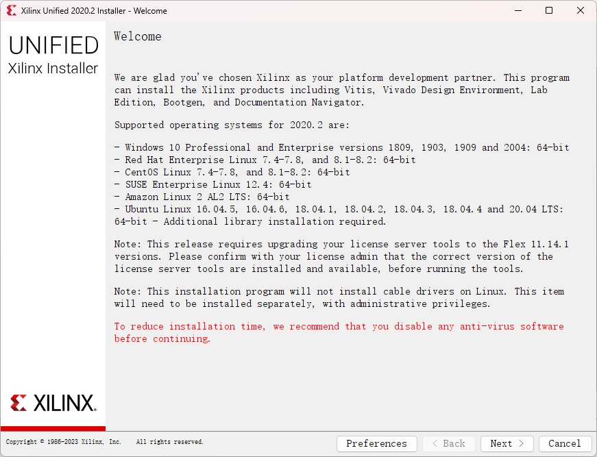
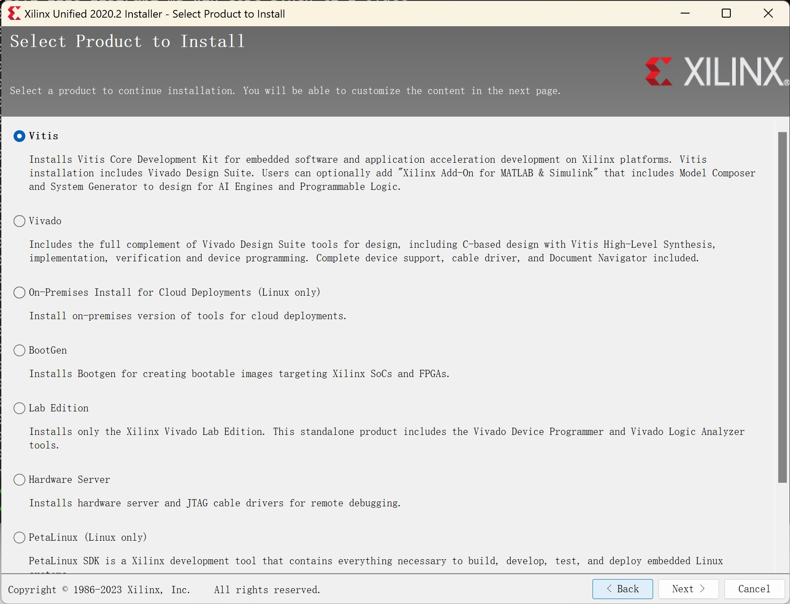
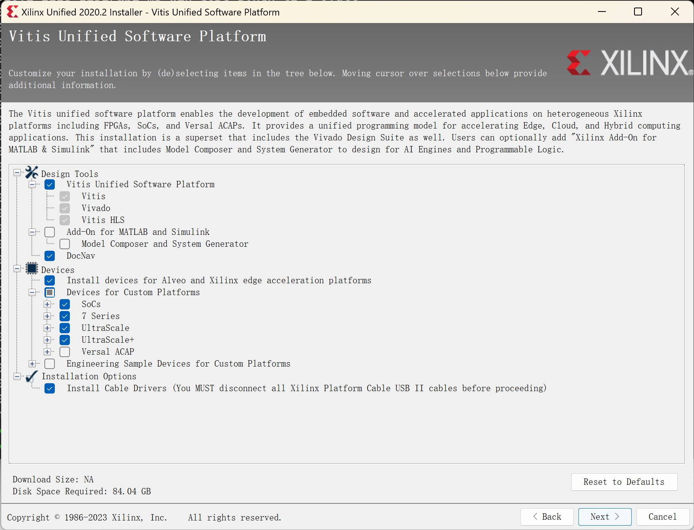
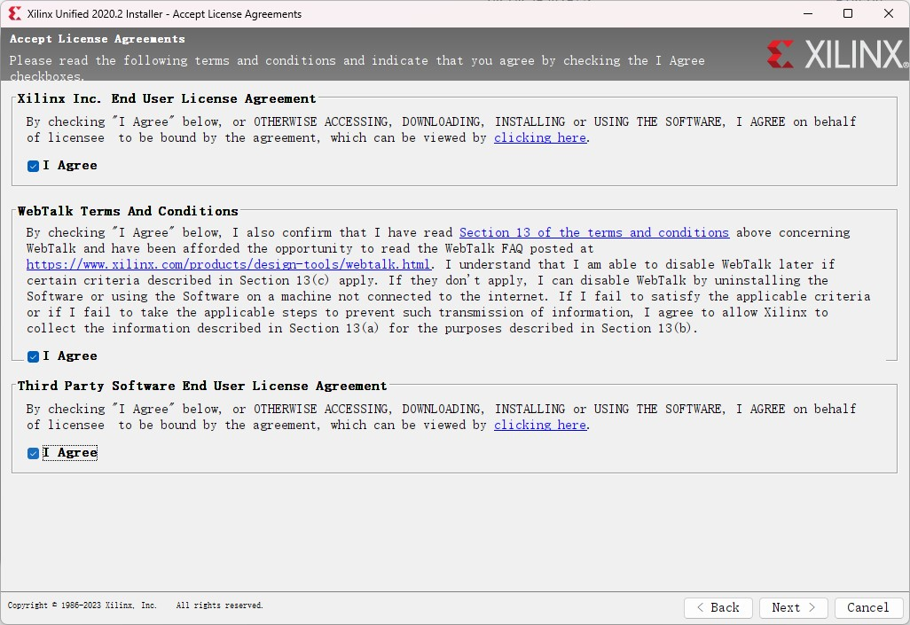
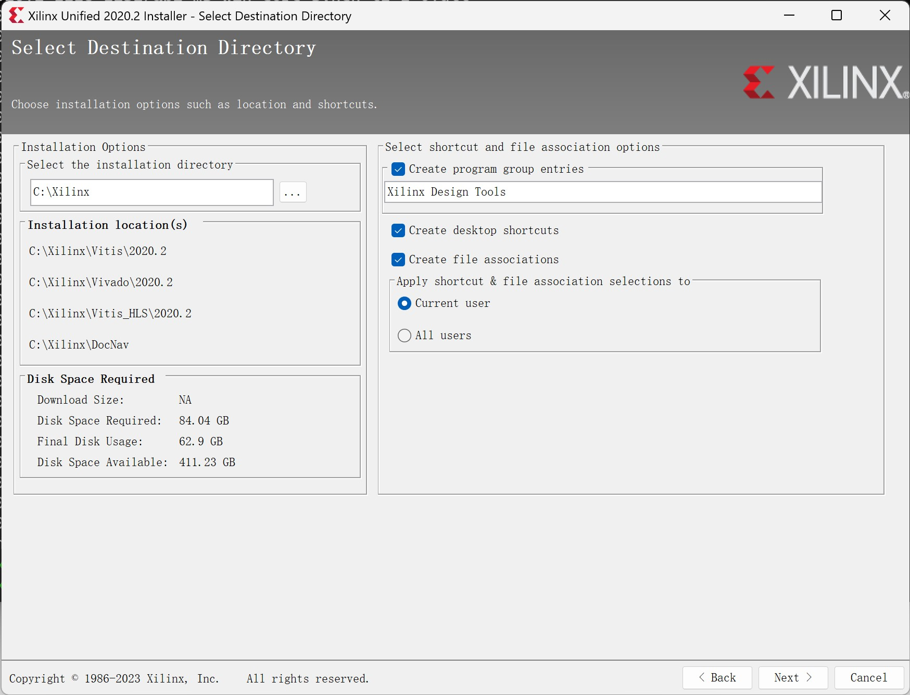

# Vitis Installation Guide
> Make sure your system has around 100GB of free space.

## Steps
1. Download package:
    * On-campus network: [https://epan.shanghaitech.edu.cn/l/qFUL5Z](https://epan.shanghaitech.edu.cn/l/qFUL5Z)
    * Off-campus network: [https://www.xilinx.com/member/forms/download/xef.html?filename=Xilinx_Unified_2020.2_1118_1232.tar.gz](https://www.xilinx.com/member/forms/download/xef.html?filename=Xilinx_Unified_2020.2_1118_1232.tar.gz)
  
1. Extract the tarball and launch the installer.
   * For Windows: double-click on `xsetup.exe`
   * For Linux: run `sudo ./xsetup` in terminal.
    

    
    

   
   
    Click **Next**.

1. Select **Vitis**, click **Next**.
   

    
    

1. **Check the boxes** as below, click **Next**.
   

    
    

1. Check all the **I Agree** boxes. Click **Next**
   

    
    

1. Change the **installation directory** if needed. Click **Next**
   

    
    

1. Review the configurations and click **Install**.
1. Wait for the installer to finish.

> Contect TA if you have any problems.