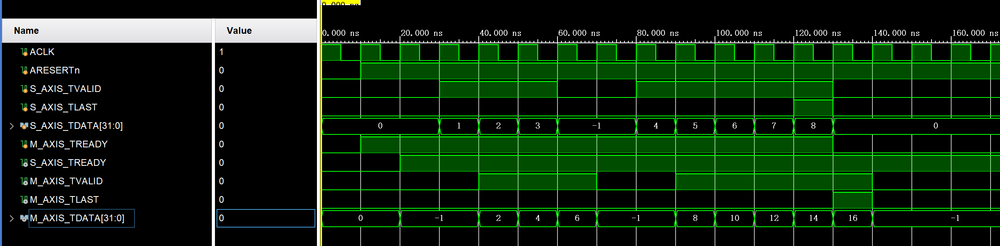
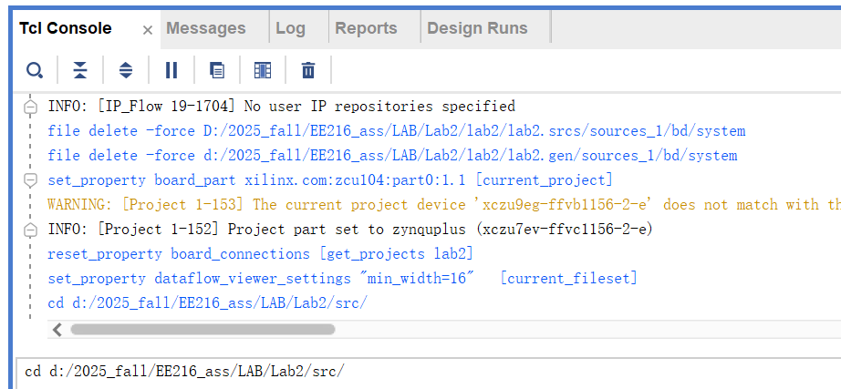
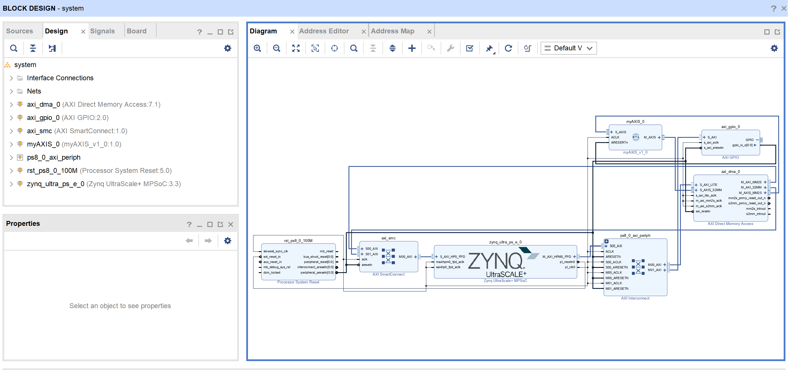
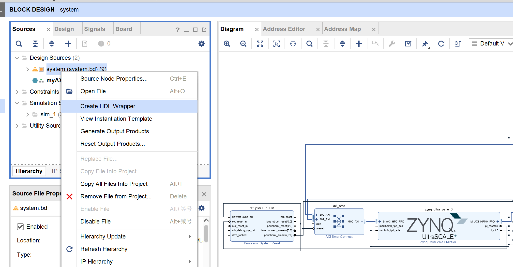
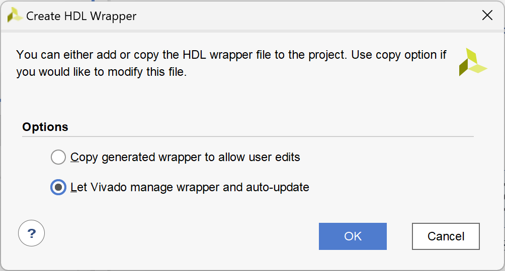
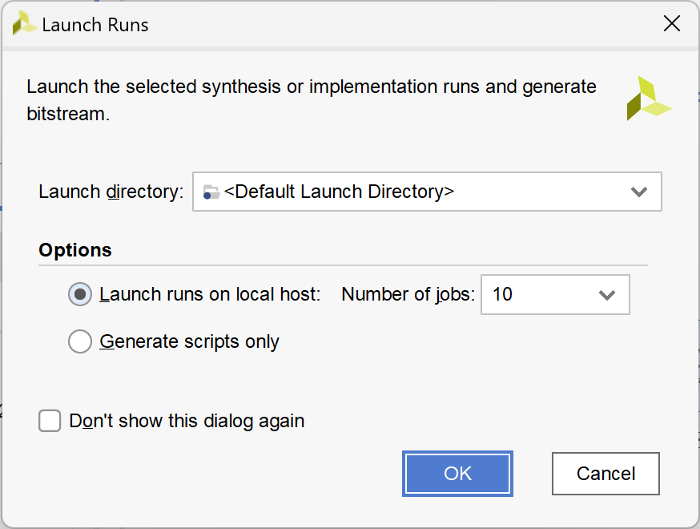
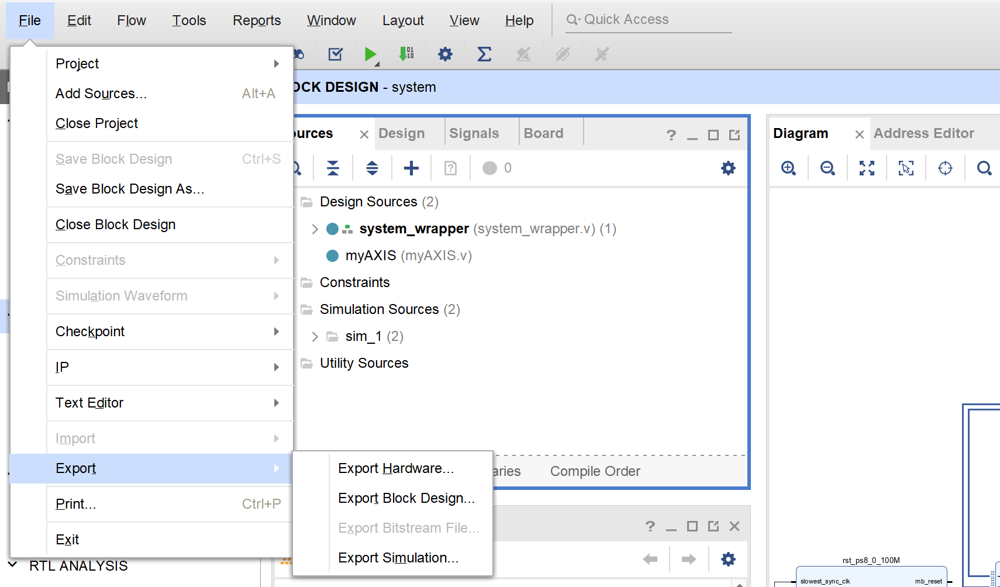
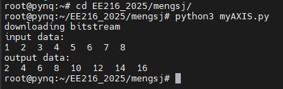

# Lab2 AXI4-Stream Protocal Design
In this lab, we will introduce the AXI-Stream interface for RTL design.

## Introduce the AXI4-Stream Protocal
The AXI4-Stream protocol is designed for unidirectional data transfers from master to slave with greatly reduced signal routing. The key features:
* Supports single and multiple data streams using the same set of shared wires
* Supports multiple data widths within the same interconnect
* Ideal for implementation in FPGAs

### Interface signals
* Main signals

| Signal | Source | Description |
|-|-|-|
| **ACLK** | Clock source | The global clock signal. All signals are sampled on the rising edge of ACLK. |
| **ARESETn** | Reset source | The global reset signal. ARESETn is active-LOW. |
| **TVALID** | Master | TVALID indicates that the master is driving a valid transfer. A transfer takes place when both TVALID and TREADY are asserted. |
| **TREADY** | Slave | TREADY indicates that the slave can accept a transfer in the current cycle. |
| **TDATA** | Master | TDATA is the primary payload that is used to provide the data that is passing across the interface. The width of the data payload is an integer number of bytes. |
| **TLAST** | Master | TLAST indicates the boundary of a packet. |

* Other signals: **TSTRB**, **TKEEP**, **TDEST**, **TUSER**, **TID**

## Design a AXI4-Stream IP using Vivado
1. Launch **Vivado 2020.2** and create a new RTL project with name **ee216_lab2**. Select **ZCU104** as the target board.
1. Click on **Add Sources** in the Project Manager, select **Add or create design sources**, click on **Next**.
1. Select **Add Files**, browse to `lab2/src` and select `myAXIS.v`, click on **OK**. Click **Finish**.
1. Read and try to understand the code, figure out below questions:
    * How does the module receive input data?
    * What the module does with the input data?
    * How does the module send output data?
    * Why **S_AXIS_TLAST** is delayed?
1. Select **Add Sources > Add or create simulation sources > Add Files**, browse to add `myAXIS_tb.v` from `lab2/src` folder.
1. Launch simulation by clicking on **Run Simulation > Run Bevavioral Simulation**. You should see the below waveform.
  <p align="center">
      
  </p>

### Generate bitstream
We will create a block design and use AXI-DMA to transfer data between FPGA and ARM processor. In this lab, you do not need to know how to create the block design, just follow the steps below.

1. In the Tcl Console, change the directory to `Lab2/src` folder.
    ```
    cd d:/2025_fall/EE216_ass/LAB/Lab2/src/
    ```
    <p align="center">
      
    </p>

1. Create block design using the given TCL script.
    ```
    source block_design.tcl
    ```
    <p align="center">
      
    </p>
1. In the Sources Tab, right-click on **system (system.bd)** and select **Create HDL Wrapper**. Select **Let Vivado manage...**, click **OK**.
    <p align="center">
      
    </p>
    <p align="center">
      
    </p>
1. Click on **Generate Bitstream** from the Flow Navigator. Click **OK** to launch runs.
    <p align="center">
      
    </p>
1. When finish, Click on **File > Export Bitstream File**, select a location and rename the bitstream file with **myAXIS.bit**.
    <p align="center">
      
    </p>

1. In the project folder, browse to `ee216_lab2.gen\sources_1\bd\system\hw_handoff`, copy the `system.hwh` file to the same location as the bitstream file, rename it with **myAXIS.hwh**.

### Run on the board
1. Connect the ZCU104 board using any SSH tools
    * IP address: 10.19.138.63
    * Port: 9022
    * Username: root
    * Password: ee2162025

1. Upload the `myAXIS.bit`, `myAXIS.hwh`, `myAXIS.py` to the board.
    
> For public use, please create your own folder and do not save any important files on the board, the board can be cleaned at any time.
    
1. Run the test
    ```bash
    python3 myAXIS.py
    ```
    <p align="center">
      
    </p>
